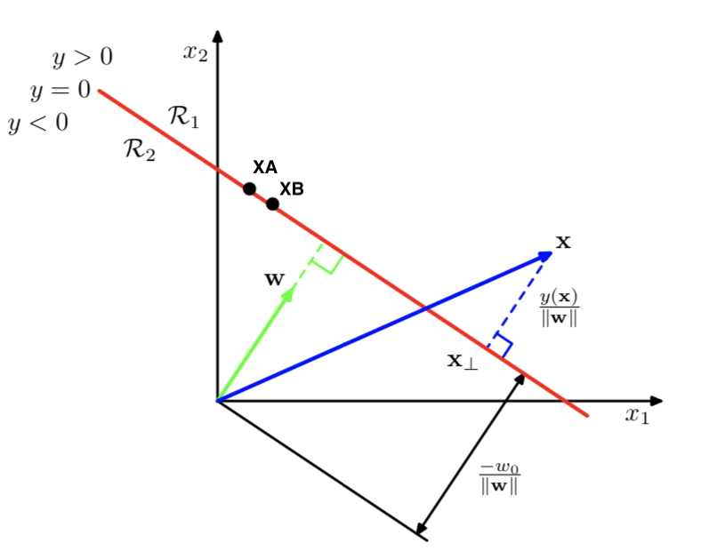
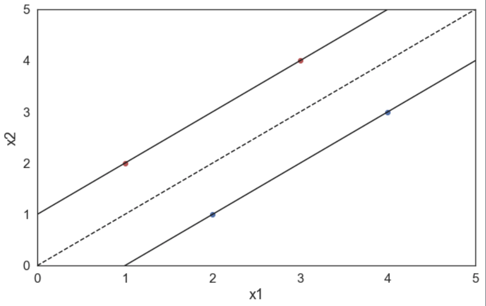

## SVM

### Basic Concepts

**training set:** 

N input vectors $\mathbf{x}_1, \mathbf{x}_2, …, \mathbf{x}_N​$

N target value: $t_1, t_2, …, t_N$ and $t_n \in \{-1, 1\}, n=1,2,…N$

Define $y(\mathbf{x}) = \mathbf{w}^T\phi(\mathbf{x})+b$

Now we assume data is linearly separable, then we got:

- $y(\mathbf{x}_n) > 0$ for $t_n = +1$
- $y(\mathbf{x}_n) < 0$ for $t_n = -1$ 

Notice: $t_ny(\mathbf{x}_n) > 0​$ holds for all training data points.

**margin:**

Margin is the smallest distance between decision boundary and any of the samples and our object is to maximise this margin.

$y(\mathbf{x}_A) = y(\mathbf{x}_B) = 0$ (because they are both in the decision boundary)

so we got:  $\mathbf{w}^T(\mathbf{x}_A - \mathbf{x}_B) = 0​$

The vector $\mathbf{w}$ is orthgonal to every vetor within decision surface.

### The large margin principle

Assuming $\phi(\mathbf{x}) =\mathbf{x} ​$, so $y(x) = \mathbf{w}^T\mathbf{x}+w_0​$

For points in the boundary: 

​	$y(\mathbf{x}) = 0​$

​	$\mathbf{w}^T\mathbf{x} + w_0 = 0$

​	$\frac{\mathbf{w}^T\mathbf{x}}{||\mathbf{w}||} = - \frac{w_0}{||\mathbf{w}||}​$

For arbitrary $\mathbf{x}​$

​	$\mathbf{x} = \mathbf{x}_\perp + r\frac{\mathbf{w}}{||\mathbf{w}||}​$   ($\mathbf{x}_\perp​$ is the orthgonal projection onto the decision surface)

​	$\frac{\mathbf{w}}{||\mathbf{w}||}$ provides the unit vector, so how to calculate $r$ (the distance from the decision boundary whose 	normal vector is $\mathbf{w}$?

​	substract $\mathbf{x} = \mathbf{x}_\perp + r\frac{\mathbf{w}}{||\mathbf{w}||}$ into $y(\mathbf{x}) = \mathbf{w}^T\mathbf{x} + w_0$ 

​	$f(x) = \mathbf{w}^T\mathbf{x} + w_0 = (\mathbf{w}^T\mathbf{x}_\perp+w_0) + r\frac{\mathbf{w}^T\mathbf{w}}{||\mathbf{w}||}$

​	$\because y(\mathbf{x}_\perp) = \mathbf{w}^Tx_\perp + w_0 = 0$

​	$\therefore y(\mathbf{x}) = r\frac{\mathbf{w}\mathbf{w}^T}{||\mathbf{w}||}$

​	$\therefore r = \frac{y(\mathbf{x})}{||\mathbf{w}||}$

Notice: $\mathbf{w}​$ determines the orientation of the decision surface

​	     $w_0$ dertermines the location of the decision surface  

Now, we would like to make this distance $r = \frac{y(\mathbf{x})}{||\mathbf{w}||}$ as large as possible. 

In addition, we want to ensure each point is on the correct side of the boundary. For all points correctly classified:

​	$t_ny(\mathbf{x}_n) > 0$

The distance of a point $x_n​$ to the decision surface is defined by:

​	$\frac{t_ny(\mathbf{x}_n)}{||\mathbf{w}||} = \frac{tn(\mathbf{w}^T\phi(\mathbf{x}_n)+w_0)}{||\mathbf{w}||}$

So, maximise margin is found by:

​	$\underset{\mathbf{w},w_0}{\operatorname{argmax}}\{\frac{1}{||\mathbf{w}||}\underset{n}{\operatorname{min}}[\mathbf{t}_n(\mathbf{w}^T\phi(\mathbf{x}_n)+w_0)]\}$	

We notice that,

​	if $\mathbf{w} \rightarrow k\mathbf{w}, w_0 \rightarrow kw_0​$, $\frac{\mathbf{t}_ny(\mathbf{x}_n)}{||\mathbf{w}||}​$ is unchanged. Since the $k​$ factor cancels out when we divide by $||\mathbf{w}||​$ 

So now we can choose a factor $k$ such that $\mathbf{t}_n(\mathbf{w}^T\phi(\mathbf{x}_n)+w_0) = 1$ for support vectors, then all data points will satisfy: 

​	$\mathbf{t}_n(\mathbf{w}^T\phi(\mathbf{x}_n)+w_0) \ge 1, n = 1,…, N ​$

The problem now is:

​	maximise $\frac{1}{||\mathbf{w}||}$ , and this is equivalent to minimise $||\mathbf{w}||^2$

so, 

​	$\underset{\mathbf{w},w_0}{\operatorname{argmax}}\{\frac{1}{||\mathbf{w}||}\underset{n}{\operatorname{min}}[\mathbf{t}_n(\mathbf{w}^T\phi(\mathbf{x}_n)+w_0)]\} \Rightarrow \underset{\mathbf{w},w_0}{\operatorname{argmin}}\frac{1}{2}||\mathbf{w}||^2$

​	s.t. $\mathbf{t}_n(\mathbf{w}^T\phi(\mathbf{x}_n)+w_0) \ge 1$

\*\*\*\*\*\*\*\*\*\*\*\*\*\*\*\*\*\*\*\*\*\*\*\*\*\*\*\*\*\*\*\*\*\*\*\*\*\*\*\*\*\*\*\*\*\*\*\*\*\*\*\*\*\*\*\*\*\*\*\*\*\*\*\*\*\*\*\*\*\*

In order to solve this, we use Lagrange multipliers: $a_n \ge 0​$

​	$\mathcal{L}(\mathbf{w},w_0,a) = \frac{1}{2}||\mathbf{w}||^2 - \sum^N_{n=1}a_n\{{t_n}(\mathbf{w}^T\phi(\mathbf{x}_n)+w_0)-1\}$

Why "$-$" sign? $\Rightarrow$ Because we want to minimise with respect to $\mathbf{w}$ and $b$, and maximise with respect to $a$ .

Then we compute the partial derivative with respect to $\mathbf{w}​$ and $b​$ respectively and set them to 0:

​	$\frac{\part\mathcal{L}}{\part\mathbf{w}} = 0$								$\frac{\part\mathcal{L}}{\part{w_0}} = 0$

​	$\mathbf{w} = \sum^N_{n=1}a_nt_n\phi(\mathbf{x}_n)$					$\sum^N_{n=1}a_nt_n = 0$

Then we eliminate $\mathbf{w}$ and $b$ from $\mathcal{L}(\mathbf{w},w_0,a)$:

​	$\tilde{\mathcal{L}}(a) = \sum^N_{n=1}a_n  - \frac{1}{2}\sum^N_{n=1}\sum^N_{m=1}a_na_mt_nt_mk(\mathbf{x}_n,\mathbf{x}_m)$

​	s.t. $a_n \ge 0, \sum^N_{n=1}a_nt_n = 0$

\*\*\*\*\*\*\*\*\*\*\*\*\*\*\*\*\*\*\*\*\*\*\*\*\*\*\*\*\*\*\*\*\*\*\*\*\*\*\*\*\*\*\*\*\*\*\*\*\*\*\*\*\*\*\*\*\*\*\*\*\*\*\*\*\*\*\*\*\*\*

### Soft margin

In the previous section, we assume the data is linearly separable, what if the data is not linearly separable?

$\Rightarrow$ we can use kernel trick

But what if the data is still not linearly separable after using kernel trick?

$\Rightarrow​$ We introduce slack variables $\xi_n \ge 0​$.  

$\begin{cases} \xi_n = 0 \text{ if the point is on or inside the correct margin boundary} \\ \xi_n = |t_n - y(\mathbf{x}_n)| \text{ othereise}\end{cases}$

e.g. 

If $0 < \xi_n \le 1$, the point lies inside the margin, but on the correct side of the decision boundary. 

If $\xi_n > 1$, the point lies on the wrong side of the decision boundary. 

We now replace the hard constraints that $t_ny(\mathbf{x}_n) \ge 0$ with the **soft margin constraints** that $t_ny(\mathbf{x}_n) \ge 1- \xi_n$

The new objective becomes :

$\underset{\mathbf{w},w_0,\mathbf{\xi}}{\operatorname{min}}\frac{1}{2}||\mathbf{w}||^2 + C\sum^N_{n=1}\xi_n$

s.t. $\xi_n \ge 0 \text{ and } t_n(\mathbf{x}_n^T\mathbf{w} + w_0) \ge 1 - \xi_n $

$C$ is a regularisation parameter to control the number of erros we can tolerate. 

< we usually define $C = \frac{1}{\nu N}$, $\nu$ is used to contro the fraction of misclassified points, and $0 < \nu \le 1$. This is called $\nu$-SVM. > 

\*\*\*\*\*\*\*\*\*\*\*\*\*\*\*\*\*\*\*\*\*\*\*\*\*\*\*\*\*\*\*\*\*\*\*\*\*\*\*\*\*\*\*\*\*\*\*\*\*\*\*\*\*\*\*\*\*\*\*\*\*\*\*\*\*\*\*\*\*\*

### Probabilistic output

Notice, the ouput of SVM is a hard-labeling (sign$(y(\mathbf{x})$), unlike logistic regression, which produces probabilistic output. So how can we convert the hard-labeling into probabilistic output?

$\Rightarrow$ $p(t = 1 |\mathbf{x},\mathbf{\theta}) = \sigma(ay(\mathbf{x})+b)$

where $a, b$ can be estimated by maximum likelihood on a separate validation set.

\*\*\*\*\*\*\*\*\*\*\*\*\*\*\*\*\*\*\*\*\*\*\*\*\*\*\*\*\*\*\*\*\*\*\*\*\*\*\*\*\*\*\*\*\*\*\*\*\*\*\*\*\*\*\*\*\*\*\*\*\*\*\*\*\*\*\*\*\*\*

### Multi-class classification

$\Rightarrow$ One-versus-all (OVA)

$\Rightarrow$ One-versus-one (OVO)

### Example

Given a training set consisting of four points $([1,2],+1), ([3,4],+1), ([2,1],-1)​$ and $([4,3],-1)​$, find the corrdinates of $\mathbf{w} = [u,v]​$ and $b​$ that minimise $||\mathbf{w}||​$ subject to:

​					$y_i(\mathbf{w}\cdot\mathbf{x}_i + b) \ge 1​$ for all $i = 1,…,4​$ 

$y(x) = \mathbf{w}^T\mathbf{x} + b​$

we find $y(x) = 0​$ intersects $(0,0)​$, so $x_1 = x_2​$  

$y(x) = w_1x_1 + w_2x_2 +b​$

$cx_1 = cx_2​$ 

$cx_1 - cx_2 = 0$

$\begin{bmatrix} c -c\end{bmatrix}^T \begin{bmatrix} x_1\\x_2\end{bmatrix} + 0 = 0$

$\therefore \mathbf{w} = \begin{bmatrix} c\\ -c \end{bmatrix}, b = 0​$

substract $\mathbf{w}$ and $b$ into the equation with four points:

$\begin{cases}c - 2c \ge 1\\ 3c - 4c \ge 1\\ 2x - c \le -1\\ 4c - 3c \le -1 \end{cases}​$          $\Rightarrow​$  $c\le -1​$

$\underset{\mathbf{w}}{\operatorname{min}}||\mathbf{w}|| = \underset{c}{\operatorname{min}}|c|​$

and this is subject to $c\le -1$

$\therefore c = -1 $, $\mathbf{w} = \begin{bmatrix} -1\\1\end{bmatrix}$ and $b=0​$

